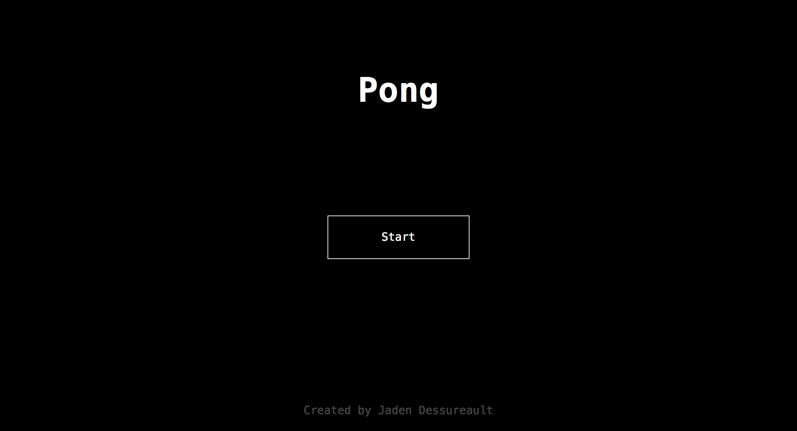
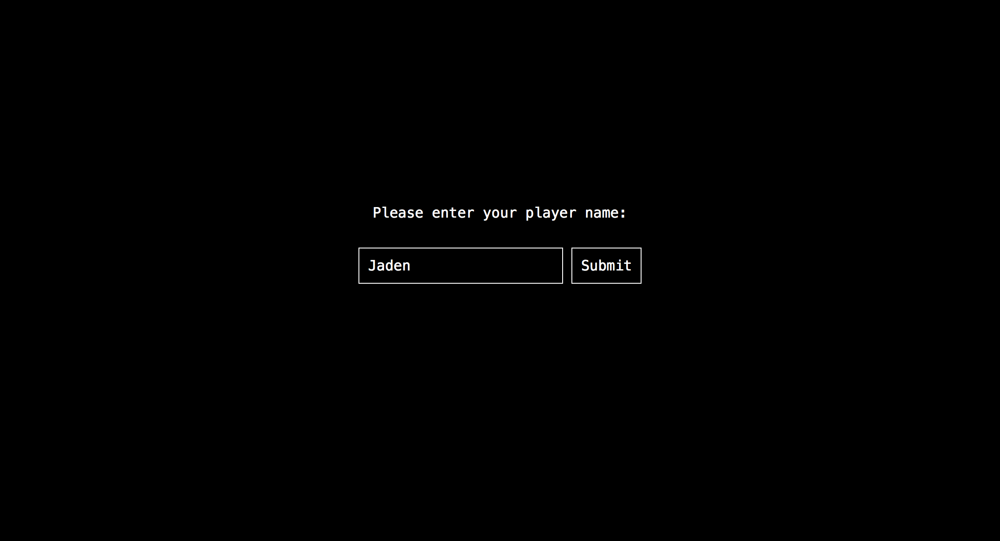
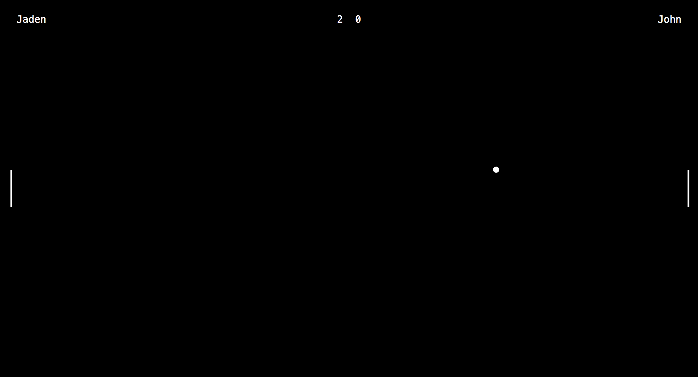

# Pong

Classic two player *Pong* game written with [node.js](http://nodejs.org) & [p5.js](http://p5js.org). This was the final project for my semester 1 computer science class.

Screenshots:

Packages:

- [express](http://expressjs.com)
- [socket.io](http://socket.io)
- [ejs](http://www.embeddedjs.com)
